<a href="https://andres-llorens.netlify.app/">
  <picture>
    <source media="(prefers-color-scheme: dark)" srcset="assets/header-dark.svg">
    <source media="(prefers-color-scheme: light)" srcset="assets/header-light.svg">
    
  </picture>
</a>

  
  
  
  
  

I'm a game developer from Valencia with **5+ years** building games and real-time 3D products in **Unity** and **Godot**. I started making mods at 16 and haven't stopped since. These days I focus on what keeps a game healthy as it grows: gameplay systems, internal tools, data-driven content and performance on the target hardware.

- 🎰 **Now** · Senior Game Developer at **Degestec Games**, where I designed the core architecture of a Godot slots game for Android and web.
- 🔥 **My studio** · Founder of **[Pal Lobby Games](https://pallobbygames.com/)**, launching **Circuit Flow** on Google Play soon.
- 🥽 **Before** · Led **MindSafe4U**, an EU-funded VR game presented at **MWC 2025**.
- 🤝 **Open to** · Gameplay, tools, systems or XR roles. Remote, hybrid or on-site.

## Featured work

### ⚡ Circuit Flow

<a href="https://pallobbygames.com/games/circuit-flow/">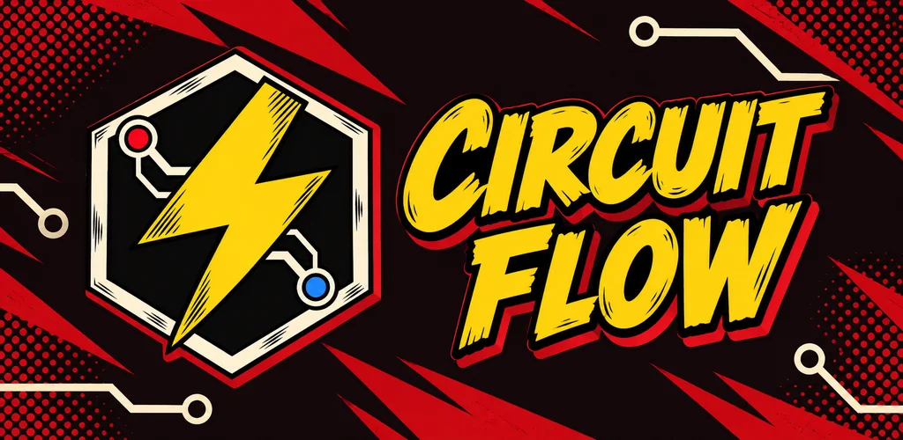</a>

**Connect the circuit. Power every target.** A comic-style logic puzzle for Android: rotate circuit pieces, press POWER and watch red, blue and purple signals travel across the board. Every target needs the right colour and strength.

  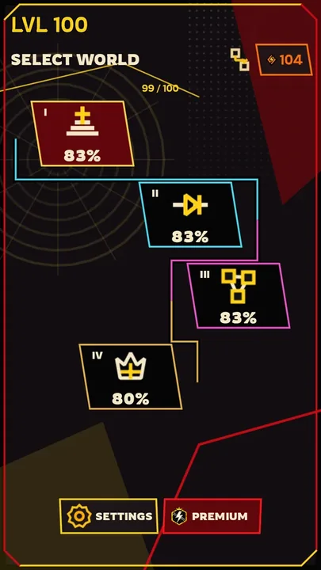
  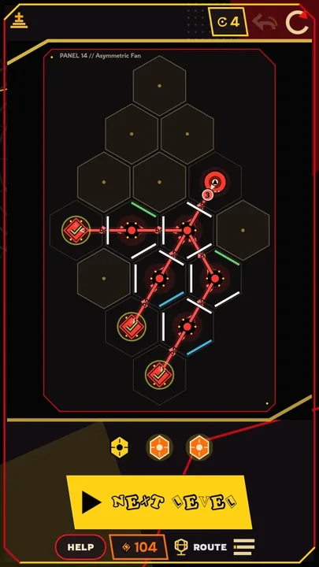
  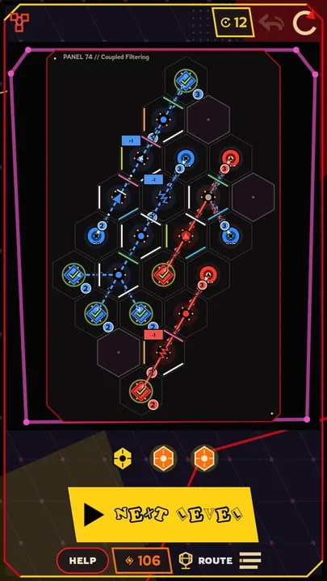
  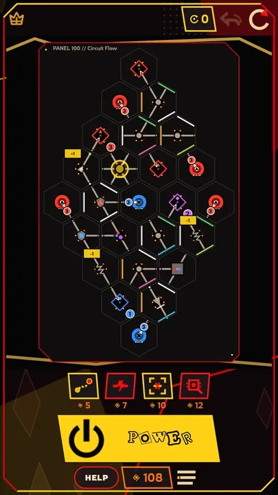

**100** campaign puzzles · **4** worlds with new mechanics · **20** extra challenges · _Coming soon to Google Play_

**What I built** as founder and lead developer at Pal Lobby Games (2026):

- **Game and level design:** a 100-level campaign authored as data with my own level editor.
- **Gameplay:** Godot 4 and GDScript, with a deterministic signal simulation for colour and strength.
- **Android:** Google Play Games cloud saves, AdMob and a one-time Premium purchase.
- **CI:** GitHub Actions running headless regression tests and automated Android builds.

`Godot 4` `GDScript` `Android` `Google Play Games` `AdMob` `GitHub Actions`

<table>
  <tr>
    <td width="50%" valign="top">

<a href="https://mindsafe4u.com/">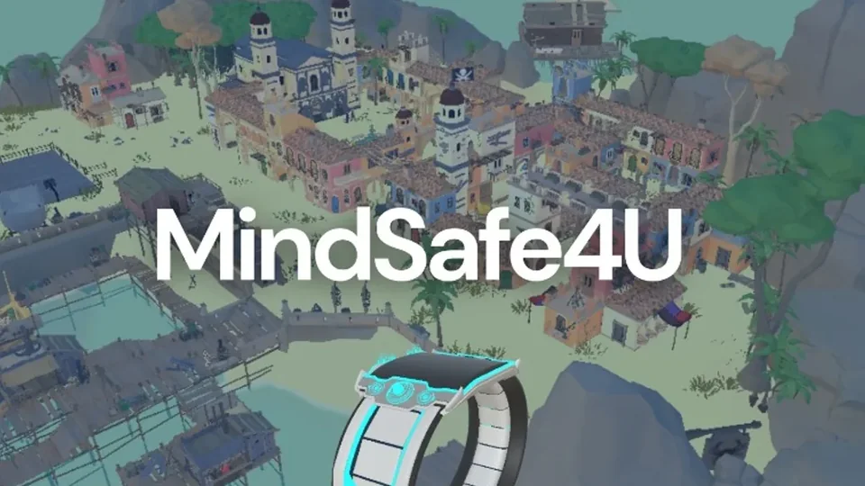</a>

#### 🥽 MindSafe4U

VR game for standalone headsets · Grupo Saltó · 2022–2025

A VR game that promotes mental health and helps prevent violence among children aged 8–12, created with the University of Girona and funded by the Spanish Government and the EU (NextGenerationEU). **Presented at MWC 2025.**

**Lead Unity Developer.** Led the full development cycle, built a graph-based dialogue system and editor tools for the content team, and optimised large dynamic scenes to run stable on Meta Quest and PICO.

[Website](https://mindsafe4u.com/) · [MWC 2025 press coverage](https://www.segre.com/ca/societat/250305/mwc-presenta-videojoc-realitat-virtual-made-in-lleida-per-prevenir-l-assetjament_747478.html)

`Unity` `C#` `VR` `Azure DevOps`

</td>
    <td width="50%" valign="top">

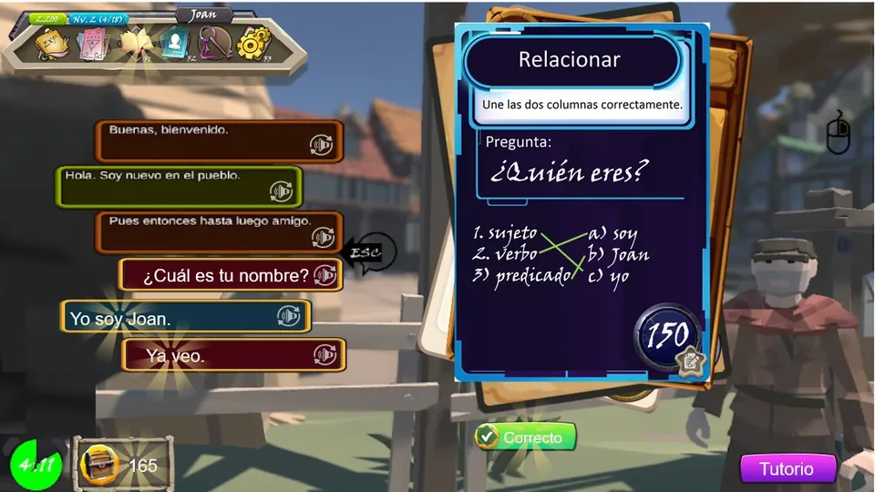

#### 🗾 Elecante

Educational game · Freelance · 2021–2022

A gamified adventure for Japanese students learning Spanish: players progress by talking to NPCs, reading the context and building answers with a card-based dialogue system.

**Game developer.** Designed and built the full experience in Unity: audiovisual dialogue, level progression and content configuration, plus tools that let educators adjust lessons without touching code.

`Unity` `C#` `MongoDB` `Azure DevOps`

</td>
  </tr>
</table>

<table>
  <tr>
    <td width="33%" valign="top">
      <a href="https://andreullorens.itch.io/crismonisland">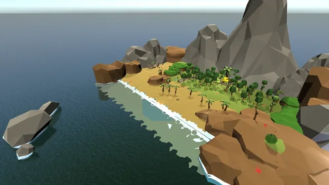</a>
       <b>Crimson Island</b> · Educational adventure
       Pirate-island exploration, puzzles and crafting to practise English as a second language. <a href="https://andreullorens.itch.io/crismonisland">Play on itch.io</a>
    </td>
    <td width="33%" valign="top">
      <a href="https://andreullorens.itch.io/project-sound">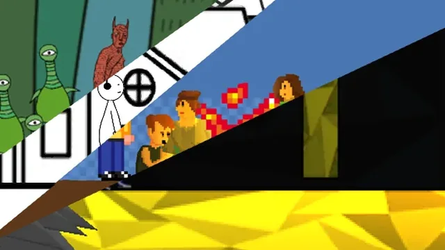</a>
       <b>Project Sound</b> · 2D platformer
       Music, colour and atmosphere evolve as the player progresses. <a href="https://andreullorens.itch.io/project-sound">Play on itch.io</a>
    </td>
    <td width="33%" valign="top">
      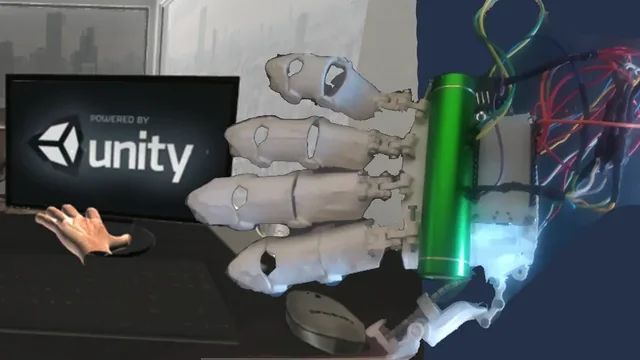
       <b>Hand Controller Tracker</b> · Hardware
       A wearable glove controller (Arduino + Unity) that turns hand gestures and movement into game input.
    </td>
  </tr>
</table>

Also on GitHub: [game jam prototypes](https://github.com/DewBlack/Games) built over a weekend, and [Terminal Capitalism](https://github.com/DewBlack/terminal-capitalism), a satirical stock-market roguelike in Godot 4 with a regression smoke-test suite.

## Experience

| When | Role | Where | Focus |
| :-- | :-- | :-- | :-- |
| 2026&nbsp;–&#8288;&nbsp;now | **Founder & Lead Developer** | [Pal&nbsp;Lobby&nbsp;Games](https://pallobbygames.com/) | Design, code and release of Circuit Flow |
| 2025&nbsp;–&#8288;&nbsp;now | **Senior Game Developer** | Degestec Games | Godot architecture for Android and web, Docker, CI/CD |
| 2022&nbsp;–&#8288;&nbsp;2025 | **Lead Unity Developer** | Grupo Saltó | MindSafe4U for Meta Quest and PICO, dialogue and editor tools |
| 2022 | **Unity 3D Developer** | Universae | Educational simulations for WebGL and Android |
| 2021&nbsp;–&#8288;&nbsp;2022 | **Unity Developer** | Freelance | Elecante and no-code tools for educators |
| 2017&nbsp;–&#8288;&nbsp;2020 | **Lead Unity Developer & Designer** | Universitat&nbsp;Jaume&nbsp;I | Serious games for university research projects |

🎓 **B.Sc. in Game Design and Development**, Universitat Jaume I (2016–2021) · 🗣️ Spanish and Catalan (native), English (professional)

## What I bring to a team

- 🎮 **Gameplay & systems:** gameplay architecture, mechanics, state machines and input, save/load and serialization, dialogue systems.
- 🛠️ **Tools & pipelines:** custom editor tools, ScriptableObjects and inspectors, data-driven content, level editors.
- 📱 **XR, mobile & performance:** VR/MR interaction, Meta Quest and PICO, Android and WebGL, profiling and optimization.
- 🚀 **Production:** Git, Jira and Azure DevOps, CI/CD with GitHub Actions and Docker, Agile/Scrum, technical coordination.

  <picture>
    <source media="(prefers-color-scheme: dark)" srcset="https://skillicons.dev/icons?i=unity%2Cgodot%2Ccs%2Cpy%2Cmysql%2Cmongodb%2Cgit%2Cgithubactions%2Cdocker%2Cblender%2Candroidstudio&theme=dark">
    <source media="(prefers-color-scheme: light)" srcset="https://skillicons.dev/icons?i=unity%2Cgodot%2Ccs%2Cpy%2Cmysql%2Cmongodb%2Cgit%2Cgithubactions%2Cdocker%2Cblender%2Candroidstudio&theme=light">
    
  </picture>

## My studio

<a href="https://pallobbygames.com/"></a>

In 2026 I founded **Pal Lobby Games** to create and publish original games, made to enjoy, discover and come back to. Our first release is **Circuit Flow**. The studio is also open to:

- Collaborations on original games
- Development support in Unity and Godot
- Commissioned games and prototypes

[pallobbygames.com](https://pallobbygames.com/) · [pallobbygames@gmail.com](mailto:pallobbygames@gmail.com)

## Contribution arcade

<picture>
  <source media="(prefers-color-scheme: dark)" srcset="https://raw.githubusercontent.com/DewBlack/DewBlack/output/pacman-contribution-graph-dark.svg">
  <source media="(prefers-color-scheme: light)" srcset="https://raw.githubusercontent.com/DewBlack/DewBlack/output/pacman-contribution-graph.svg">
  
</picture>

My contribution graph, regenerated every day and eaten by Pac-Man.

---

  <b>Let's make something good.</b> 
  Hiring for gameplay, tools, systems or XR? <a href="mailto:andreullorens98@gmail.com">Email me</a>. Have a project for the studio? <a href="mailto:pallobbygames@gmail.com">Write to Pal Lobby Games</a>.

